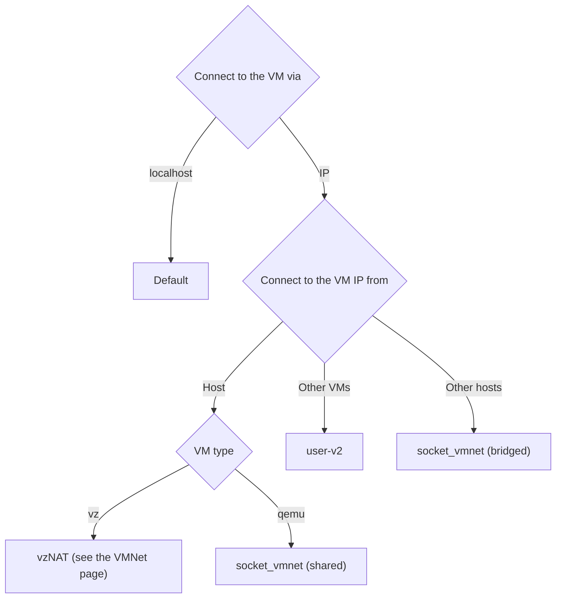

See the following flowchart to choose the best network for you:

```mermaid
flowchart
connect_to_vm_via{"Connect to the VM via"} -- "localhost" --> default["Default"]
  connect_to_vm_via -- "IP" --> connect_from{"Connect to the VM IP from"}
  connect_from -- "Host" --> vm{"VM type"}
  vm -- "vz" --> vzNAT["vzNAT (see the VMNet page)"]
  vm -- "qemu" --> shared["socket_vmnet (shared)"]
  connect_from -- "Other VMs" --> userV2["user-v2"]
  connect_from -- "Other hosts" --> bridged["socket_vmnet (bridged)"]
```
