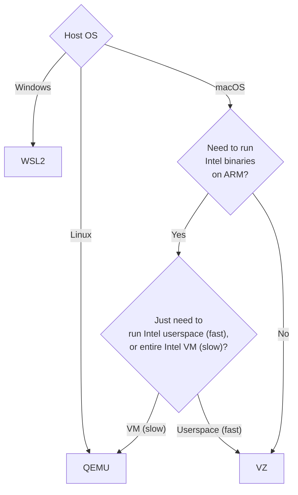

Lima supports several VM drivers for running guest machines:

The vmType can be specified only on creating the instance.
The vmType of existing instances cannot be changed.

See the following flowchart to choose the best vmType for you:

The default vmType is QEMU except on macOS 13 or newer,
unless the config is incompatible with VZ. (e.g. cross-architecture emulation)
